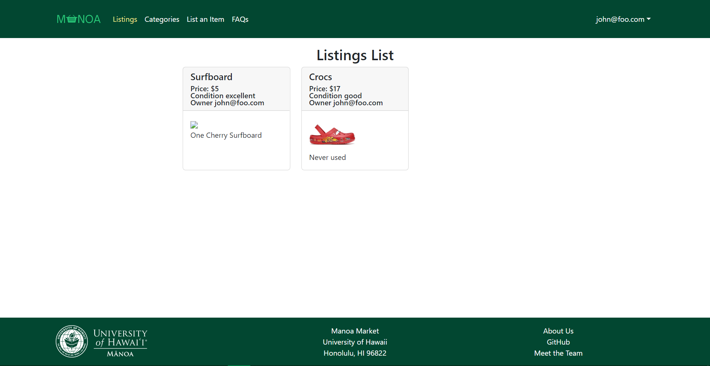

# Manoa Market

## Table of contents

* [Overview](#overview)
* [User Guide](#user-guide)
* [Community Feedback](#community-feedback)
* [Developer Guide](#developer-guide)
* [Development History](#development-history)
* [Contact Us](#contact-us)

## Overview

Manoa Market is a web application that allows UH students, faculty, or staff to sell or purchase personal goods. At the end of every semester, there is always a large amount of unneeded or excess items. Students have textbooks they no longer have use for or dorm furniture to get rid of before they graduate. We intend to create an environment for all members of the UH system that allows "campus-specific" goods to be recycled and reused effectively.

To ensure the authenticity and safety of those involved in every purchase. Users are obligated to connect their accounts with UH credentials, so there is no anonymity. In addition, there is an explicit expectation that all transactions should occur on campus grounds. 

## User Guide

This section provides a walkthrough of the Manoa Market user interface and its capabilities.

### Landing Page

The landing page is presented to users when they visit the top-level URL to the site.


### Sign in and sign up

Click on the "Login" button in the upper right corner of the navbar, then select "Sign in" to go to the following page and login. You must have been previously registered with the system to use this option:


Alternatively, you can select "Sign up" to go to the following page and register as a new user:


### User Home page

Once you are logged in, you can browse through different available tabs, current listings or create your own. 


### Listings page 

The Listings page allows for user to look at all current listings in the UH system. 



### List Item page 

The List Item page allows for user to list an item for sale. Item name, description, price, picture, and condition will be required.  


### Categories page

The Categories page provides the ability to query the database and display the results in the page. In this case, the query displays all of the items that match one or more of the specified Categories.


## My Listings page

The My Listings page shows the listings that the owner has posted.


## Edit Listings page

The Edit Listing page allows users to edit their own listing. It also allows to update the listings status to sold.


## Community Feedback

We are interested in your experience using Manoa Market!  If you would like, please take a couple of minutes to fill out the [Manoa Market Feedback Form](). It contains short questions and will help us understand how to improve the system.

## Developer Guide

This section provides information of interest to Meteor developers wishing to use this code base as a basis for their own development tasks.

### Installation

First, [install Meteor](https://www.meteor.com/install).

Second, visit the [Manoa Market application github page](https://github.com/manoa-market/manoa-market), and click the "Use this template" button to create your own repository initialized with a copy of this application. Alternatively, you can download the sources as a zip file or make a fork of the repo.  However you do it, download a copy of the repo to your local computer.

Third, cd into the manoa-market/app directory and install libraries with:

```
$ meteor npm install
```

Fourth, run the system with:

```
$ meteor npm run start
```

If all goes well, the application will appear at [http://localhost:3000](http://localhost:3000).

### Application Design

Manoa Market is based upon [meteor-application-template-react](https://ics-software-engineering.github.io/meteor-application-template-react/) and [meteor-example-form-react](https://ics-software-engineering.github.io/meteor-example-form-react/).


## Initialization

The [config](https://github.com/bowfolios/bowfolios/tree/main/config) directory is intended to hold settings files.  The repository contains one file: [config/settings.development.json](https://github.com/bowfolios/bowfolios/blob/main/config/settings.development.json).

This file contains default definitions for Profiles, Projects, and Interests and the relationships between them. Consult the walkthrough video for more details.

The settings.development.json file contains a field called "loadAssetsFile". It is set to false, but if you change it to true, then the data in the file app/private/data.json will also be loaded.  The code to do this illustrates how to initialize a system when the initial data exceeds the size limitations for the settings file.


### Quality Assurance

#### ESLint

BowFolios includes a [.eslintrc](https://github.com/manoa-market/manoa-market/blob/main/app/.eslintrc) file to define the coding style adhered to in this application. You can invoke ESLint from the command line as follows:

```
meteor npm run lint
```

Here is sample output indicating that no ESLint errors were detected:

```
$ meteor npm run lint

> manoa-market@ lint /Users/jamielaurin/github/manoa-market/manoa-market/app
> eslint --quiet --ext .jsx --ext .js ./imports ./tests

$
```

ESLint should run without generating any errors.

It's significantly easier to do development with ESLint integrated directly into your IDE (such as IntelliJ).

## Development History

The development process for Manoa Market conformed to [Issue Driven Project Management](https://courses.ics.hawaii.edu/ics314f22/modules/project-management/) practices. In a nutshell:

* Development consists of a sequence of Milestones.
* Each Milestone is specified as a set of tasks.
* Each task is described using a GitHub Issue, and is assigned to a single developer to complete.
* Tasks should typically consist of work that can be completed in 2-4 days.
* The work for each task is accomplished with a git branch named "issue-XX", where XX is replaced by the issue number.
* When a task is complete, its corresponding issue is closed and its corresponding git branch is merged into master.
* The state (todo, in progress, complete) of each task for a milestone is managed using a GitHub Project Board.

The following sections document the development history of Manoa Market.

### Milestone 1: Mockup Development

The goal of Milestone 1 was to create a set of React page mockups. The pages which were implemented are:
 
* Landing 
* User Home
* List Item
* Listings
* Categories 
* Meet The Team

The goals of Milestone 1 was be managed using [Manoa Market GitHub Project Board M1](https://github.com/orgs/manoa-market/projects/1/views/1):


### Milestone 2: Data Model Development

The goal of Milestone 2 was to implement the data model: the underlying set of Mongo Collections and the operations upon them that would support the Manoa Market application.

Milestone 2 was be managed using [Manoa Market GitHub Project Board M2](https://github.com/orgs/manoa-market/projects/2/views/1):


#### Features added:
* Implement Categories
* Add listings to database
* Read listings from database
* Allow editing users own listings
* Allow users to view own listings

### Milestone 3: Final Touches


The goal of Milestone 3 was to clean up the code base and fix minor UI issues.

Milestone 3 was managed using [Manoa Market GitHub Project Board M3](https://github.com/orgs/manoa-market/projects/3/views/1):


### Digital Ocean Deployment

Deployed application can be found at [http://164.90.157.203/](http://164.90.157.203/)

## Contact Us

Manoa Market is designed, implemented, and maintained by 
[Jamie Laurin](https://jamielaurin.github.io/), 
[Daniel Luong](https://dnlluong.github.io/), 
[Evan Araki](https://evanaraki.github.io/), 
[Christian Reasoner](https://christianreasoner.github.io/), and 
[Melvin Jae Alhambra](https://melvinjae.github.io/).

Team contract can be viewed [here](https://docs.google.com/document/d/1GPZWK6PQLb15ER7ZeO9eEc9jhPR4jR-LPJiFgJTvMdE/edit?pli=1)
